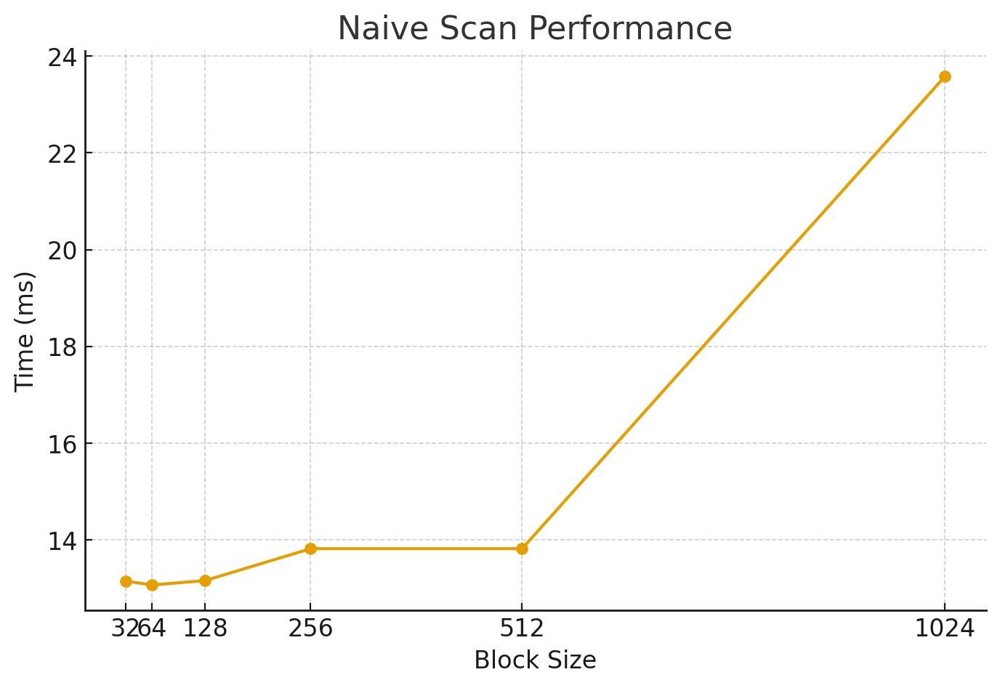
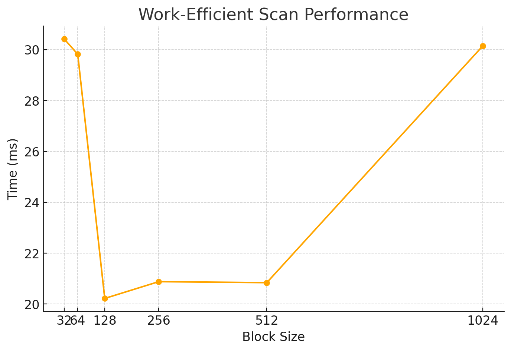
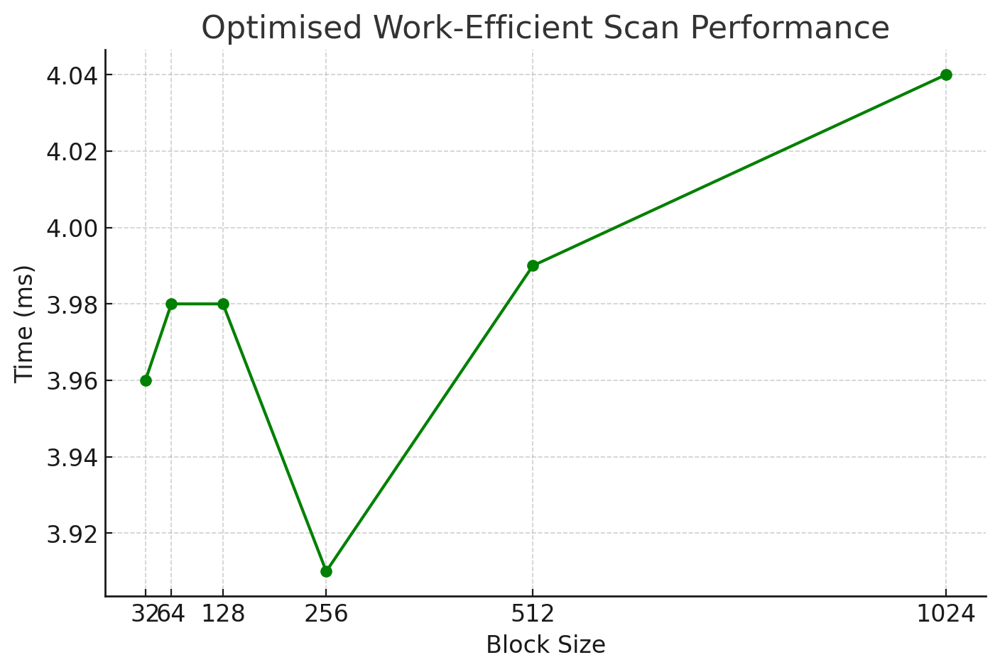
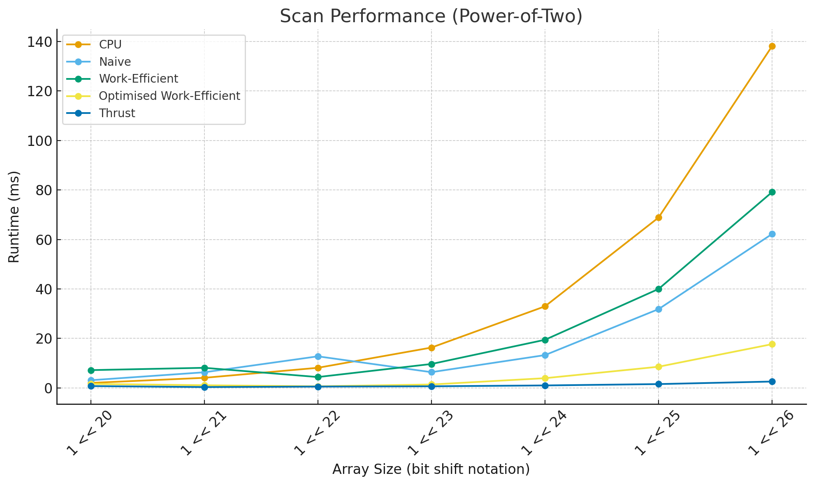
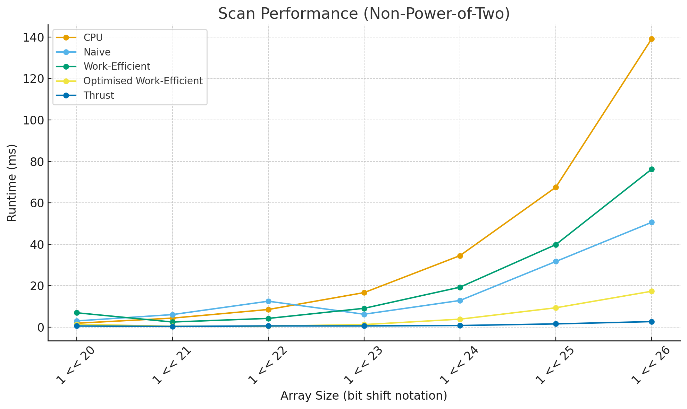
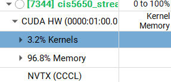

CUDA Stream Compaction
======================

**University of Pennsylvania, CIS 565: GPU Programming and Architecture, Project 2**

* Calvin Lieu
  * [LinkedIn](www.linkedin.com/in/calvin-lieu-91912927b)
* Tested on: Windows 11, i5-13450HX @ 2.40GHz 16GB, NVIDIA GeForce RTX 5050 Laptop GPU 8GB (Personal)

---
## Overview:

This project implements stream compaction in CUDA, an essential data-parallel primitive widely used in GPU applications such as path tracing. Stream compaction removes unwanted elements (in this case, zeros) from an array while preserving the order of valid elements.  

The project is structured around progressively more efficient implementations of prefix sum (scan), which is the core building block for compaction:  

- **CPU Scan & Compaction**: Baseline reference implementation using serial loops.  
- **Naive GPU Scan**: Direct parallelization of scan using multiple kernel launches.  
- **Work-Efficient GPU Scan**: Parallel tree-based algorithm with an up-sweep and down-sweep phase. Handles both power-of-two and non-power-of-two input sizes.
- **Optimised Work-Efficient GPU Scan**: Makes significant performance improvements on work-efficient scan by reducing redundant work, improving memory access patterns and using block-level parallelism.
- **GPU Stream Compaction**: Built on the work-efficient scan using map -> scan -> scatter steps.  
- **Thrust Scan & Compaction**: Leverages NVIDIA’s optimized Thrust library for comparison against custom implementations.  

---

**1. Roughly optimize the block sizes of each of your implementations for minimal run time** **on your GPU.**

**Figure 1: Naive scan performance scaling with blocksize**


**Figure 2: Work efficient scan performance scaling with blocksize**


**Figure 3: Optimised work efficient scan performance scaling with blocksize**


**Tested with array size = 1 << 24 (power of two)**
| Block Size | Naive (ms) | Work-Efficient (ms) | Optimised (ms) |
|------------|------------|----------------------|----------------|
| 32         | 13.16      | 30.42                | 3.96           |
| 64         | 13.15      | 29.82                | 3.98           |
| 128        | 13.07      | 20.22                | 3.98           |
| 256        | 13.82      | 20.88                | 3.91           |
| 512        | 13.82      | 20.84                | 3.99           |
| 1024       | 23.58      | 30.15                | 4.04           |

### Naive Scan – Optimal Block Size = **128**
 - Memory-bound: each thread just loads two values and stores one.   
 - Larger block sizes (256, etc.) add overhead without reducing memory latency.  
 - Smaller block sizes (64) underutilize the GPU and reduce occupancy.
 - Moderately sized blocks (128) hit the sweet spot for memory-limited kernels.

### Work-Efficient Scan – Optimal Block Size = **128**
 - The non-optimised scan has idle threads at higher levels of the tree.  
 - 128 threads (4 warps) balance latency hiding with fewer idle threads at deep levels.  
 - Smaller blocks (64) don’t utilize SMs well.  
 - Larger blocks (256+) create more idle threads in up/down sweeps, reducing efficiency.  
 - 128 balances occupancy and divergence

### Optimised Work-Efficient Scan – Optimal Block Size = **256**
 - Optimisation reduces idle-thread overhead by adjusting active threads.  
 - 256 threads (8 warps) achieve high occupancy without wasting cycles.  
 - Larger block sizes are now effective because divergence costs are mitigated.  
 - Performance is less sensitive to block size overall compared to the non-optimised version.  

---

**2. Compare all of these GPU Scan implementations (Naive, Work-Efficient, and Thrust) to the serial CPU version of Scan. Plot a graph of the comparison (with array size on the independent axis).**

**Figure 4: Scan performance with increasing array size (powers of two)**


**Figure 5: Scan performance with increasing array size (non-powers of two)**


---

**3. Write a brief explanation of the phenomena you see here. Can you find the performance bottlenecks? Is it memory I/O? Computation? Is it different for each implementation?**

## Explanation of the Phenomena and Bottlenecks

### CPU
- Outperforms GPU implementations with smaller `n` due to lack of thread scheduling overhead and better cache locality
- The performance improvements offered by GPU implementations at large array sizes outweigh the overhead, hence outperforming CPU ~ n = 1 << 21 or 1 million elements for my optimised work-efficient implementation. The non-optimised version starts outperforming ~ n = 1 << 22 and naive at 1 << 23.

### Naive Scan
-  Performance scales poorly as `n` grows, because each iteration of the loop (`ilog2ceil(n)` times) launches a kernel that touches *all* `n` elements. This creates O(n log n) work instead of O(n).
- Bottleneck: Primarily memory I/O. Each scan step requires reading and writing the entire array, even though only part of the array is being updated. Global memory traffic dominates, and the repeated global memory reads/writes at every step overshadow arithmetic costs.  
- At large sizes, sometimes naive seems competitive or even faster than unoptimized work-efficient — this is due to simpler memory access patterns (just linear reads/writes), which can be more cache- and coalescing-friendly than the scattered tree updates in Blelloch.


### Unoptimised Work-Efficient Scan
- Better asymptotic complexity (O(n)) but each upsweep/downsweep step accesses array indices with strided patterns (e.g., offsets doubling/halving each pass). This reduces memory coalescing efficiency.  
- Bottleneck: Memory I/O inefficiency. Even though total work is less than naive, strided global memory accesses -> non-coalesced loads/stores -> wasted bandwidth. For smaller arrays, kernel launch overhead also dominates.  
- This explains why unoptimized work-efficient scan underperforms compared to naive at certain array sizes.

### Optimized Work-Efficient Scan
- Using block-level parallelism (fewer threads per offset, better bounds checking, fewer wasted accesses) reduces redundant work. Each kernel only processes the active subset of nodes.  
- Bottleneck: Still somewhat memory bound, but memory access patterns are improved (fewer unnecessary global ops). Arithmetic cost is negligible compared to memory transfer.  
- This consistently beats both naive and unoptimized versions for large `n`. The performance flattens because at some point memory throughput (global bandwidth) is saturated.

---

### Thrust
**Figure 6: Thrust NSight Time Consumption**




- Memory ops took up almost 97% of the time!
- Thrust may use shared memory + warp intrinsics to minimize global memory traffic, achieving close to peak GPU memory throughput.
- There are also likely a number of other optimisations which thrust has that are not present in my scan implementations

---
**4. Paste the output of the test program into a triple-backtick block in your README.** 
NB: Tests were added to test optimised work-efficient scan. Output is for array size 1 << 24
```
****************
** SCAN TESTS **
****************
    [   4  23  21  19  40  40  14  47  11  39  25  32  20 ...  22   0 ]
==== cpu scan, power-of-two ====
   elapsed time: 34.1281ms    (std::chrono Measured)
    [   0   4  27  48  67 107 147 161 208 219 258 283 315 ... 410814527 410814549 ]
==== cpu scan, non-power-of-two ====
   elapsed time: 33.8403ms    (std::chrono Measured)
    [   0   4  27  48  67 107 147 161 208 219 258 283 315 ... 410814496 410814506 ]
    passed
==== naive scan, power-of-two ====
   elapsed time: 13.0071ms    (CUDA Measured)
    passed
==== naive scan, non-power-of-two ====
   elapsed time: 12.8967ms    (CUDA Measured)
    passed
==== work-efficient scan, power-of-two ====
   elapsed time: 20.1725ms    (CUDA Measured)
    passed
==== work-efficient scan, non-power-of-two ====
   elapsed time: 19.793ms    (CUDA Measured)
    passed
==== work-efficient scan optimised, power-of-two ====
   elapsed time: 3.9872ms    (CUDA Measured)
    passed
==== work-efficient scan optimised, non-power-of-two ====
   elapsed time: 4.20819ms    (CUDA Measured)
    passed
==== thrust scan, power-of-two ====
   elapsed time: 0.879616ms    (CUDA Measured)
    passed
==== thrust scan, non-power-of-two ====
   elapsed time: 0.910368ms    (CUDA Measured)
    passed

*****************************
** STREAM COMPACTION TESTS **
*****************************
    [   0   0   3   0   2   1   3   2   2   1   3   2   0 ...   1   0 ]
==== cpu compact without scan, power-of-two ====
   elapsed time: 40.785ms    (std::chrono Measured)
    [   3   2   1   3   2   2   1   3   2   3   2   1   1 ...   2   1 ]
    passed
==== cpu compact without scan, non-power-of-two ====
   elapsed time: 37.6362ms    (std::chrono Measured)
    [   3   2   1   3   2   2   1   3   2   3   2   1   1 ...   2   3 ]
    passed
==== cpu compact with scan ====
   elapsed time: 90.1643ms    (std::chrono Measured)
    [   3   2   1   3   2   2   1   3   2   3   2   1   1 ...   2   1 ]
    passed
==== work-efficient compact, power-of-two ====
   elapsed time: 7.484ms    (CUDA Measured)
    [   3   2   1   3   2   2   1   3   2   3   2   1   1 ...   2   1 ]
    passed
==== work-efficient compact, non-power-of-two ====
   elapsed time: 7.30176ms    (CUDA Measured)
    [   3   2   1   3   2   2   1   3   2   3   2   1   1 ...   2   3 ]
    passed
```
